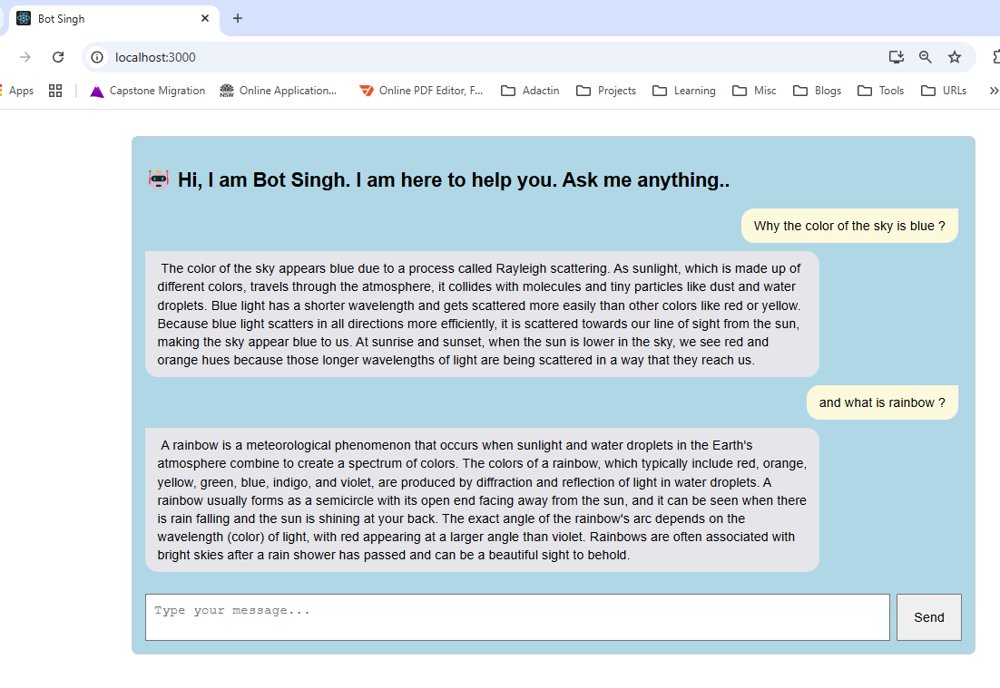

# 🧠 Chatbot with React + Ollama + Mistral

A fully functional chatbot UI built with **React**, powered by **Ollama** running the **Mistral** open-source language model locally. No external API calls or internet access required — fully offline AI.

---

## 🚀 Demo

 <!-- Optional: Add your own screenshot -->

---

## 🔧 Features

- 🤖 Chat interface using React + TypeScript
- 🧠 Local LLM responses using [Ollama](https://ollama.com/)
- 🔁 Real-time streaming of AI responses
- 🌐 Fully offline chatbot (no OpenAI API key required)
- 📂 Easy to modify, extend, or integrate

---

## 🖥️ Tech Stack

- React + TypeScript
- Ollama (local LLM runtime)
- Mistral model (7B parameter open-source LLM)
- CSS (custom-styled interface)

---

## 🛠️ Setup Instructions

### 1. Clone the Repo

```bash
git clone https://github.com/creativesatinder/chatbot-ollama-mistral.git
cd chatbot-ollama-mistral


2. Install Dependencies
bash
Copy
Edit
npm install
3. Install Ollama (if not already installed)
Follow instructions at: https://ollama.com/download

Start the Ollama server:

bash
Copy
Edit
ollama run mistral
This will download the Mistral model and keep the server running locally at http://localhost:11434.

4. Start the Chatbot App
bash
Copy
Edit
npm start
Open browser at http://localhost:3000

Start chatting!

📂 File Structure
csharp
Copy
Edit
src/
├── Chatbot.tsx        # Main chatbot UI component
├── Chatbot.css        # Styling
public/
├── demo-screenshot.png # Optional screenshot
💡 Example Prompt
User: Why is the sky blue?
Bot (Mistral): The sky appears blue due to Rayleigh scattering...

📌 Notes
Ollama must be running in the background.

Model used: mistral (you can change it in the fetch request to other models like llama2, llama3, etc.).

All AI responses are generated locally – nothing is sent to external servers.

📄 License
MIT – free to use, modify, and share.

🙋‍♂️ Author
Satinder Pal Singh
Senior Fullstack Engineer | React | .NET | AI Enthusiast
LinkedIn | GitHub
